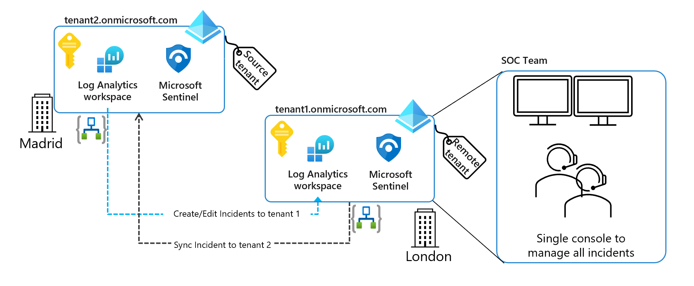

# manage-incidents-on-different-tenants-remotely

The main goal of this two playbooks is to give ability to manage incidents remotely (the same way as Azure LightHouse does) but available for any location (include locations that aren't natively integrating with Azure). The main advantage for SOC team is to avoid multiple consoles to manage multiple incidents in multiple tenants.

## Architecture

### Tenant 2
- location: remote location (for example outside of SOC location)
- triggers: assuming that have a dedicated log analytics workspace for themselves
- data connectors: not relevant. The playbook based in this tenant will trigger an incident creation/update in the source tenant (Tenant 1) as soon as got updated manually/automatically through any analytic rules

### Tenant 1
- location: main location (soc-based location for example)
- main purpose: managing multiple subscriptions/tenants and want to have all incidents hosted in the same subscription (a replica of many different locations)
- data connectors: n/a. 

## Pre-requisites
This approach assumes the following resources on each tenant.

### Tenant 2 (remote tenant)
| Resource Type           | Activity                                        	  		  | Permissions and notes	          				 			                                   |
|-------------------------|---------------------------------------------------------------|------------------------------------------------------------------------------------------------|
| **Managed Identity**  | Authenticate on source tenant (tenant 2)   	   		          | Sentinel Contributor (RG level), Log Analytics reader (RG level)  			     	           |
| **App Registration**  | Authenticate on remote tenant (tenant 1)   	   		          | Log Analytics reader (RG level), Sentinel Contributor (RG level), Reader (RG level) (Optional) |
| **API Connection**	  | To access Sentinel on source tenant (tenant 2) 		          | Connect with Managed Identity								                                   |
| **API Connection**	  | To access Sentinel on remote tenant (tenant 1) 		          | Connect with Service Principal (or app registration)					                       |
| **API Connection**	  | To access Log Analytics Workspace on remote tenant (tenant 1) | Connect with Service Principal (or app registration) 					                       |

### Tenant 1 (source tenant)
| Resource Type           | Activity                                        	  		  | Permissions and notes	          				 			                                   |
|-------------------------|---------------------------------------------------------------|------------------------------------------------------------------------------------------------|
| **Managed Identity**  | Authenticate on remote tenant (tenant 1)   	   		          | Sentinel Contributor (RG level), Log Analytics reader (RG level)  			     	           |
| **App Registration**  | Authenticate on source tenant (tenant 2)   	   		          | Log Analytics reader (RG level), Sentinel Contributor (RG level), Reader (RG level) (Optional) |
| **API Connection**	  | To access Sentinel on remote tenant (tenant 1) 		          | Connect with Managed Identity								                                   |
| **API Connection**	  | To access Sentinel on source tenant (tenant 2) 		          | Connect with Service Principal (or app registration)					                       |
| **API Connection**	  | To access Log Analytics Workspace on source tenant (tenant 2) | Connect with Service Principal (or app registration) 					                       |

## Notes
Additionally, to get fully functionality, is recommended to create Automation rules in both tenants to run this playbooks automatically
