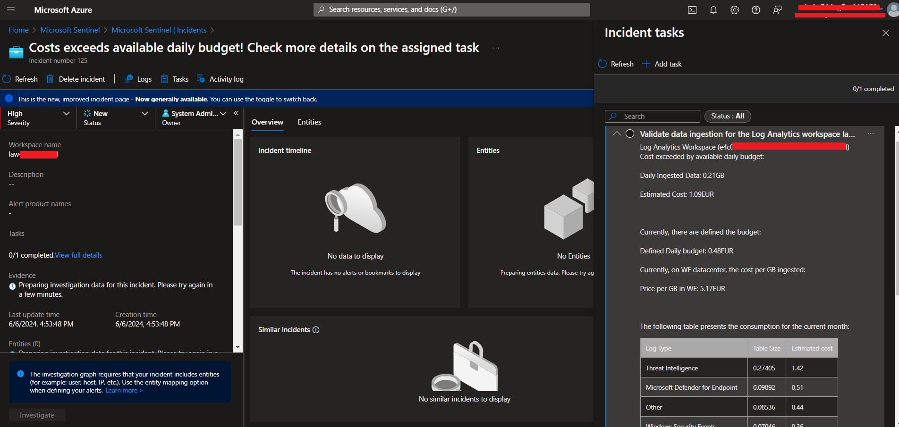
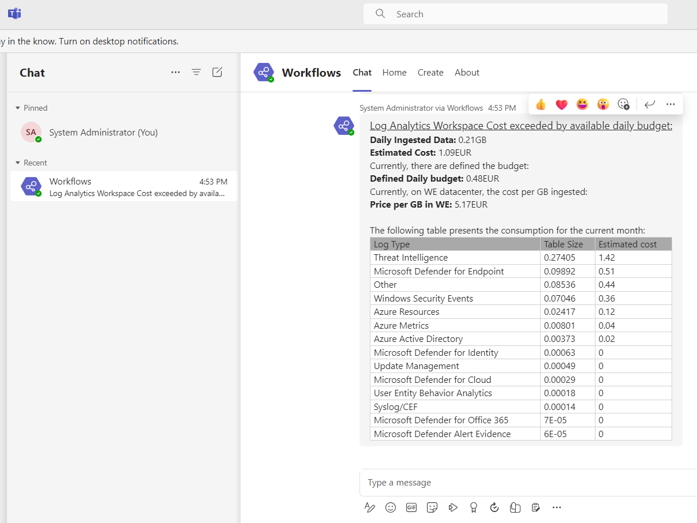

# README.md

## Title
Monitor Log Analytics Workspace ingestion data

## Description
The main goal is to define a monthly budget to support Log Analytics ingestion, and have a Playbook (Sentinel logic app) that checks every hour (can be adapted for sure) if the budget is already achieved. If so, creates a Sentinel incident and notifies through a Bot Chat on Microsoft Teams

## Prerequisites
Managed identity to Get info from Log Analytics workspace. Microsoft Teams account.

## User Experience
On Sentinel

On Teams

## Last Update Time
2024-06-06T00:00:00.000Z

## Entities
n/a

## Tags
budget-management

## Support
Community

## Author
FBVitor